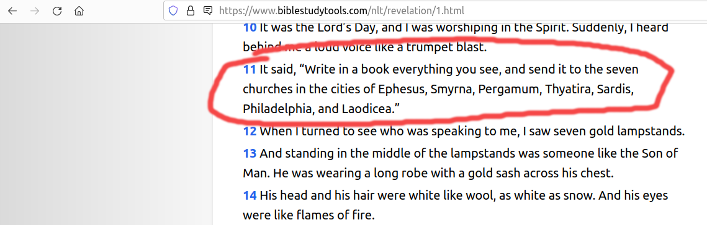

## Base for this entry:

 Quotes 

### 2 Tymoteusza 3, 16-17

    3:16
    Całe Pismo jest natchnione przez Boga i pożyteczne do 
    nauki, do strofowania, do poprawiania, do wychowywania 
    w sprawiedliwości;

    3:17
    Aby człowiek Boży był doskonały, do wszelkiego dobrego 
    dzieła w pełni przygotowany.

### Objawienie 22, 18-19

    22:18
    Oświadczam zaś każdemu, kto słucha słów proroctwa tej 
    księgi: Jeśli ktoś dołoży coś do tego, dołoży mu też 
    Bóg plag opisanych w tej księdze;

    22:19
    A jeśli ktoś odejmie coś ze słów księgi tego 
    proroctwa, odejmie też Bóg jego dział z księgi życia i 
    ze świętego miasta, i z rzeczy, które są opisane w tej 
    księdze.

## Case for verses

### Revelation 11,6

Show comparison

NLT

KJV

    Saying, I am Alpha and Omega, the first and the last: and, What thou seest, write in a book, and send it 
    unto the seven churches which are in Asia; unto 
    Ephesus, and unto Smyrna, and unto Pergamos, and unto 
    Thyatira, and unto Sardis, and unto Philadelphia, and 
    unto Laodicea.

UBG

    Który mówił: Ja jestem Alfa i Omega, pierwszy i 
    ostatni. Co widzisz, napisz w księdze i poślij do 
    siedmiu kościołów, które są w Azji: do Efezu, Smyrny, 
    Pergamonu, Tiatyry, Sardes, Filadelfii i Laodycei.

