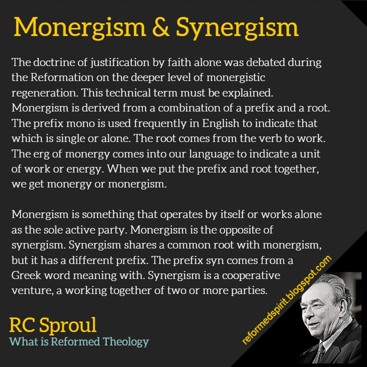

# Is faith a work question

# The Bible

Ephesian 2,8-9

#### Important note! 
Salvation is a gift, not faith. We get this gift by faith.

[Russian]Спасение - это дар, а не вера. Мы получаем этот дар по вере.

[English](https://www.biblegateway.com/passage/?search=Ephesians+2%3A8-9&version=KJV)  
[English with context](https://www.biblegateway.com/passage/?search=Ephesians+2%3A5-11&version=KJV)

[Russian](https://www.biblegateway.com/passage/?search=Ephesians+2%3A8-9&version=RUSV)   
[Russian with context](https://www.biblegateway.com/passage/?search=Ephesians+2%3A5-11&version=RUSV)

[Polish](https://www.biblegateway.com/passage/?search=Ephesians+2%3A8-9&version=UBG)    
[Polish with context](https://www.biblegateway.com/passage/?search=Ephesians+2%3A5-11&version=UBG)

Romans 11,6

#### Important note
Notice that faith and works are 2 different categories that can't be in no way mixed

[Russian] Обратите внимание, что вера и дела - это две разные категории, которые ни в коем случае нельзя смешивать.

[English](https://www.biblegateway.com/passage/?search=Romans+11%3A6&version=KJV)  
[English with context](https://www.biblegateway.com/passage/?search=Romans+11%3A3-9&version=KJV)

[Russian](https://www.biblegateway.com/passage/?search=Romans+11%3A6&version=RUSV)   
[Russian with context](https://www.biblegateway.com/passage/?search=Romans+11%3A3-9&version=RUSV)

[Polish](https://www.biblegateway.com/passage/?search=Romans+11%3A6&version=UBG)    
[Polish with context](https://www.biblegateway.com/passage/?search=Romans+11%3A3-9&version=UBG)

Romans 3,25-28

[English](https://www.biblegateway.com/passage/?search=Romans+3%3A25-28&version=KJV)  
[English with context](https://www.biblegateway.com/passage/?search=Romans+3%3A20-31&version=KJV)

[Russian](https://www.biblegateway.com/passage/?search=Romans+3%3A25-28&version=RUSV)   
[Russian with context](https://www.biblegateway.com/passage/?search=Romans+3%3A20-31&version=RUSV)

[Polish](https://www.biblegateway.com/passage/?search=Romans+3%3A25-28&version=UBG)    
[Polish with context](https://www.biblegateway.com/passage/?search=Romans+3%3A20-31&version=UBG)

 
Can Abraham bost about his works?

[Russian]Может ли Авраам рассказать о своих делах

Romans 4,1-5

[English](https://www.biblegateway.com/passage/?search=Romans+4%3A1-5&version=KJV)  

[Russian](https://www.biblegateway.com/passage/?search=Romans+4%3A1-5&version=RUSV)   

[Polish](https://www.biblegateway.com/passage/?search=Romans+4%3A1-5&version=UBG)    

Romans 4,16

Read carefully, what's the interaction between faith and grace?

My conclusions

[English] Faith establish grace, faith is a base for grace

[Russian] Вера создает благодать, вера является основой для благодати

[English](https://www.biblegateway.com/passage/?search=Romans+4%3A16&version=KJV)  

[Russian](https://www.biblegateway.com/passage/?search=Romans+4%3A16&version=RUSV)  

[Polish](https://www.biblegateway.com/passage/?search=Romans+4%3A16&version=UBG)    

Galatians 2,16

[English](https://www.biblegateway.com/passage/?search=Galatians+2%3A16&version=KJV)  
[English with context](https://www.biblegateway.com/passage/?search=Galatians+2%3A14-18&version=KJV)

[Russian](https://www.biblegateway.com/passage/?search=Galatians+2%3A16&version=RUSV)   
[Russian with context](https://www.biblegateway.com/passage/?search=Galatians+2%3A14-18&version=RUSV)

[Polish](https://www.biblegateway.com/passage/?search=Galatians+2%3A16&version=UBG)    
[Polish with context](https://www.biblegateway.com/passage/?search=Galatians+2%3A14-18&version=UBG)k quest

# Calivinistic approach

Why to enen ask this question?

Canvinist point of view considers that faith is a gift(as the outcome of regeneration, gift given by holy spirit)
[Link](https://www.ligonier.org/learn/qas/is-faith-a-work) 
Where the Bible defines faith as base for salvation and act of free will

Russian

Канвинистская точка зрения считает, что вера - это дар (как результат возрождения, дар, данный святым духом)
[ссылка](https://www.ligonier.org/learn/qas/is-faith-a-work) 
Где Библия определяет веру как основу для спасения и акт свободной воли

Canvinist point of view teaches if I on my own Believe that Jesus Christe shed His Precious on the Cross of Calvariy for me and then ressurected, and I see myself as a sinner needing savior and I trus in him(I put my faith in him), that would be considered work.

Russian

Канвинистская точка зрения учит, что если я сам верю в то, что Иисус Христос пролил за меня Свою драгоценность на Голгофском кресте, а затем воскрес, и вижу себя грешником, нуждающимся в Спасителе, и верю в Него (возлагаю на Него свою веру), то это будет считаться работой.

This part it's gonna be a little technical:( sorry for that

Monergism & Synergism

English

Russian

    Доктрина оправдания только верой обсуждалась во время 
    Реформации на более глубоком уровне монергического 
    возрождения. Этот технический термин необходимо 
    объяснить. Монергизм происходит от сочетания приставки 
    и корня. Приставка mono часто используется в 
    английском языке для обозначения того, что является 
    единственным или одиноким. Корень roo происходит от 
    глагола to work. Корень monorgy пришел в наш язык для 
    обозначения единицы работы или энергии. Когда мы 
    соединяем приставку и корень, получается monergy или 
    monergism.

    Монергизм означает, что что-то действует само по себе 
    или работает в одиночку как единственная активная 
    сторона. Монергизм противоположен синергизму. 
    Синергизм имеет общий корень с монергизмом, но у него 
    другая приставка. Приставка syn происходит от 
    греческого слова, означающего "с". Синергизм - это 
    совместное предприятие, совместная работа двух или более сторон.

    Long story short: Monergism (only one party does all of the work)
    Synergism two partis participate

    [Russian]
    Краткая история: монергизм (только одна партия выполняет всю работу)
    Синергизм - участвуют две стороны

Calvinist say that if you believed(you made a choise) -> you did some work(look below how scripture defines faith as distinct from work)

[Russian] Кальвинисты говорят, что если вы уверовали (сделали выбор) -> вы совершили определенную работу(посмотрите ниже, как Писание определяет веру в отличие от работы)

### The Bible define faith as not a work

Where Calivinistic thinking defines faith as work

I choose to trust the Bible  

Russian

Библия определяет веру как не работу

Каливинистическое мышление определяет веру как работу.

Я предпочитаю доверять Библии

