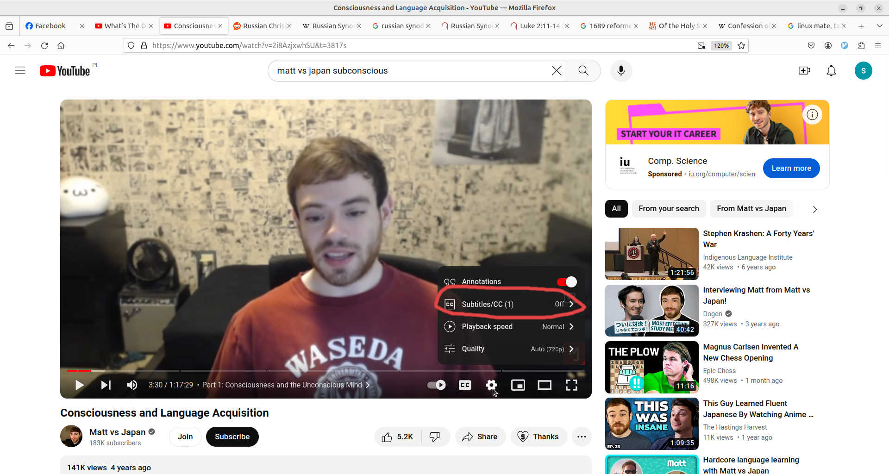
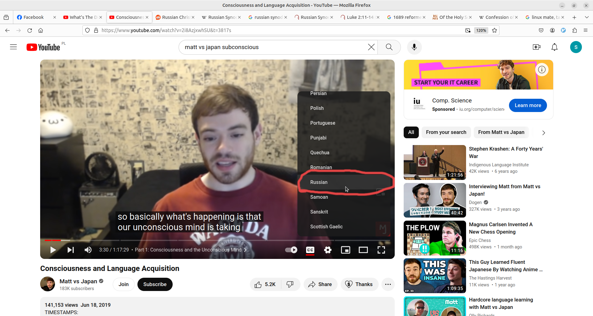

# Why did I prepare this?

As explination of how I see stuff and what I think, and as a help and resource to think on your own time and on your own pase

# How to use this?

I'll try to privide all kind of resources in 3 languages
Polish, English and Russian

### Every place I'll quote from 3 Bibles

- Polish - UWG(Uwspółcześniona Biblia Gdańska)
- English - KJV(King James Version)
- Russian

All of those can be found here:
[Bible gateway](https://www.biblegateway.com/)

### How to use video?

In every video now there is possbility to use autotranslation feature, for example: to Russian subtitles.

Here is instruction how to turn it on:

How to turn on autotranslation - Visual Instruction

1. Go to the video, example [Consciousness and Language Acquisition](https://www.youtube.com/watch?v=2i8AzjxwhSU)

2. Click on the gear icon

3. Click on Subtitles(you need to have annotations turned on)

4. Enable english autotranslated

(this opens autotranslation form more languages)

5. Go back to the same place, gear icon -> subtitles, this time there should be autotranslate option, click it

6. Pick language to autotranslate(eg: Russian)

7. Enjoy video with autotranslated language

(translation is not perfect but good enough)

