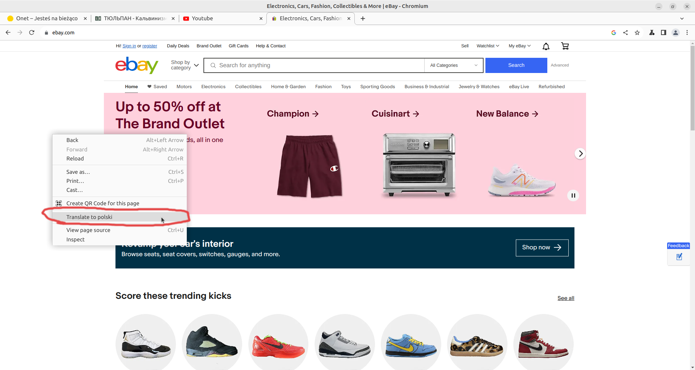

# Why did I prepare this?

As explination of how I see stuff and what I think, and as a help and resource to think on your own time and on your own pase.

Bible motivation:

John 5,39

[English](https://www.biblegateway.com/passage/?search=John+5%3A39&version=KJV)  

[Russian](https://www.biblegateway.com/passage/?search=John+5%3A39&version=RUSV)   

[Polish](https://www.biblegateway.com/passage/?search=John+5%3A39&version=UBG)    

> As a Christin I should Search the scriptures

2 Timothy 3:16-17

[English](https://www.biblegateway.com/passage/?search=2+Timothy+3%3A16-17&version=KJV)  
[Russian](https://www.biblegateway.com/passage/?search=2+Timothy+3%3A16-17&version=RUSV)   
[Polish](https://www.biblegateway.com/passage/?search=2+Timothy+3%3A16-17&version=UBG)    

> All the Bible is good for doctrine and correction

2 Timothy 2:15

[English](https://www.biblegateway.com/passage/?search=2+Timothy+2%3A15&version=KJV)  
[Russian](https://www.biblegateway.com/passage/?search=2+Timothy+2%3A15&version=RUSV)   
[Polish](https://www.biblegateway.com/passage/?search=2+Timothy+2%3A15&version=UBG)

> I should study or put an effort

# How to use this?

### If you want to spend minimal amount of time:
1h3m - [Robert Breaker, pastor](https://www.youtube.com/watch?v=q1mKtq1BBDA)

### How can you approach this?

In this folder you hava all resources I would like to use in markdown files, they are easy to open and read in the browser.

You can either:
- Go over tuplit points one by one(I number the files for convinience)
- Go directly to the resources.md and watch/read with autotranslate option

### From my side

I'm not an expert, I might be totally wrong, I'm just curiouse Bible Believing, Saved By Grace Christian.

I know that people might hold different positions and ideas, and so one. My goal is just to clarify some approaches a bit.

I've strive to choose moderate pastors(No any IFB)

I think it's benefitial to make your own mind about some topics, that's why it's benefitial to know both sides about some topic. Since I think you might have encountered one side, this is to provide another one.

I believe you can make up your own mind, and decide for yourself.

I'll try to privide all kind of resources in 3 languages
Polish, English and Russian. If it's not possible I also provided instruction how to autotranslate either webpage or youtube video.

### Every place I'll quote from 3 Bibles

- Polish - UWG(Uwspółcześniona Biblia Gdańska)
- English - KJV(King James Version)
- Russian - RUSV(Russian Synodal Version, not sure if this is good one, prefer non catholic/non east ortodox translation)

All of those can be found here:
[Bible gateway](https://www.biblegateway.com/)

### What is my advise?

I strongly encourage you to investiage yourself, to look into stuff by yourself, first yourself read think about it then ask questions and see if makes sense. 

I encourage to pray before investigation, ask Holy Spirit and God for guidiance and to discover things of God, not of man. 

I encourage to read the Bible, if somebody gives quotes of the Bible to go there, and read by yourselve.

I encourage to read quote in context, reading a little bit before(4-5 verses, and 3-4 afterwards) to figure out if someounes interpretation makes sance, or is it out of context.

I encourage to ask Holy Ghost and yourself... is this Biblical?

Thats why: If I'll qoute something(small part) I will also provide link to the Bible with wider context.

# (Translation) How to use videos and english material?

In every video now there is possbility to use autotranslation feature, for example: to Russian subtitles.

Here is instruction how to turn it on:

How to turn on autotranslation - Visual Instruction - CLICK ME

1. Go to the video, example [Consciousness and Language Acquisition](https://www.youtube.com/watch?v=2i8AzjxwhSU)

2. Click on the gear icon

3. Click on Subtitles(you need to have annotations turned on)

4. Enable english autotranslated

(this opens autotranslation form more languages)

5. Go back to the same place, gear icon -> subtitles, this time there should be autotranslate option, click it

6. Pick language to autotranslate(eg: Russian)

7. Enjoy video with autotranslated language

(translation is not perfect but good enough)

 

Autotranslate web pages - CLICK ME

All this instruction applies to chrome browser only

1. Go to any wab page/provided link
2. Click small translate icon in address bar

In case when webpage is in english icon might be missing!

In that case right click in any empty space in the webpage and click tanslate to ....

3. Click 3 dots on right side(to find more languages than english)

4. Click 'Choose another language'

5. Click on the 'English' and you should see more options, click the language you want to translate to

6. To approve translation, click translate
   

7. Enjoy translated webpage

