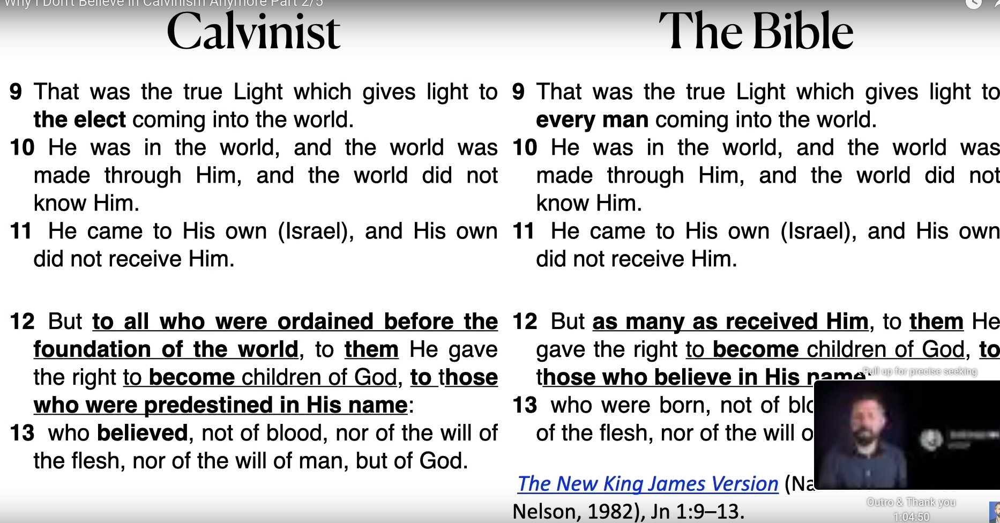

## Human responsibility

Exodus 35,26-29

    35:26
    A wszystkie kobiety, których serca >były obdarzone zdolnością<, przędły kozią sierść.
    35:27
    Przełożeni zaś przynosili kamienie onyksu i kamienie do osadzenia efodu i pektorału;
    35:28
    Także wonności i oliwę do świecenia i na olejek do namaszczania, i na wonne kadzidła.
    35:29
    Wszyscy synowie Izraela >przynosili PANU dobrowolną ofiarę<, każdy mężczyzna i każda 
    kobieta, w których było serce ochocze do składania ofiar na każde dzieło, które PAN przez 
    Mojżesza rozkazał wykonać.

Wnioski?

1. Bóg daje nam ZDOLNOŚĆ, np zdolność wiary?
2. Synowie Izraela składali DOBROWOLNE ofiary

 

1 Coryntian 7,36-38

    7:36
    Jeśli ktoś uważa, że zachowuje się niewłaściwie wobec swojej dziewicy, gdyby przeszły już 
    jej lata i jest taka potrzeba, niech czyni, co chce, bo nie grzeszy. Niech wyjdzie za mąż.
    7:37
    Lecz jeśli ktoś mocno postanowił w swym sercu, nie mając takiej potrzeby, ale >panując nad 
    własną wolą<, i osądził w swym sercu, że zachowa swoją dziewicę, dobrze czyni.
    7:38
    Tak więc ten, kto wydaje ją za mąż, dobrze czyni, ale ten, kto nie wydaje jej za mąż, lepiej czyni.

 

2 Coryntian 9,7-8

    9:8
    Lecz mówię: Kto skąpo sieje, skąpo też żąć będzie, a kto sieje obficie, obficie też żąć 
    będzie.
    9:7
    >Każdy jak postanowił w swym sercu<, tak niech zrobi, nie z żalem ani z przymusu, gdyż 
    radosnego dawcę Bóg miłuje.

## Faith

Hebres 11,1-2

    11:1
    A wiara jest podstawą tego, czego się spodziewamy, i dowodem tego, czego nie widzimy.
    11:2
    Przez nią bowiem przodkowie otrzymali chlubne świadectwo.

 

Romans 10,9-12

    10:9
    Jeśli ustami wyznasz Pana Jezusa i uwierzysz w swoim sercu, że Bóg wskrzesił go z martwych, będziesz zbawiony.
    10:10
    Sercem bowiem wierzy się ku sprawiedliwości, a ustami wyznaje się ku zbawieniu.
    10:11
    Mówi bowiem Pismo: Każdy, kto w niego wierzy, nie będzie zawstydzony.
    10:12
    Gdyż nie ma różnicy między Żydem a Grekiem; bo ten sam Pan wszystkich jest bogaty względem wszystkich, którzy go wzywają.

 

Romans 10,16-17

    10:16
    Ale nie wszyscy byli posłuszni ewangelii. Izajasz bowiem mówi: Panie, któż uwierzył naszemu głoszeniu?
    10:17
    >Wiara więc jest ze słuchania, a słuchanie – przez słowo Boże.<

## Faith preseeds regeneration

John 1,9-13

    1:9
    Ten był tą prawdziwą światłością, która oświeca każdego człowieka przychodzącego na świat.
    1:10
    Był na świecie, a świat został przez niego stworzony, ale świat go nie poznał.
    1:11
    Do swej własności przyszedł, ale swoi go nie przyjęli.
    1:12
    Lecz wszystkim tym, >którzy go przyjęli<, dał moc, >aby się stali synami Bożymi<, to jest tym, którzy wierzą w jego imię;
    1:13
    Którzy są narodzeni nie z krwi ani z woli ciała, ani z woli mężczyzny, ale z Boga.

Text vs Calvinist reading

[]

 

John 5,24-25

    5:24
    Zaprawdę, zaprawdę powiadam wam: Kto >słucha mego< słowa i >wierzy<> temu, który mnie posłał, ma życie wieczne i >nie będzie potępiony<>, ale przeszedł ze śmierci do życia.
    5:25
    Zaprawdę, zaprawdę powiadam wam: Nadchodzi godzina, i teraz jest, gdy umarli usłyszą głos Syna Bożego, a ci, którzy usłyszą, będą żyć.

 

John 6,37-40

    6:37
    Wszystko, co mi daje Ojciec, przyjdzie do mnie, a tego, który przyjdzie do mnie, nie wyrzucę precz.
    6:38
    Zstąpiłem bowiem z nieba nie po to, żeby czynić swoją wolę, ale wolę tego, który mnie posłał.
    6:39
    A to jest wola Ojca, który mnie posłał, abym nie stracił nic z tego wszystkiego, co mi dał, ale abym to wskrzesił w dniu ostatecznym.
    6:40
    I to jest wola tego, który mnie posłał, >aby każdy<, kto widzi Syna i >wierzy w niego<, miał >życie wieczne<, a ja go wskrzeszę w dniu ostatecznym.

Romans 4,3-5

    4:3
    Cóż bowiem mówi Pismo? Abraham uwierzył Bogu i zostało mu to poczytane za sprawiedliwość.
    4:4
    A temu, kto pracuje, zapłata nie jest uznana za łaskę, ale za należność.
    4:5
    Temu zaś, kto nie pracuje, lecz wierzy w tego, który usprawiedliwia bezbożnego, jego wiara zostaje poczytana za sprawiedliwość.

